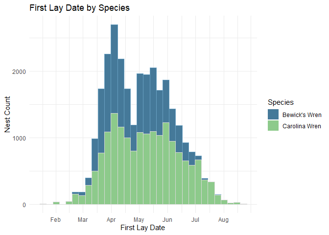

# NestWatch Data Products

<!-- badges: start -->

  


<!-- badges: end   -->

## Development Tasks :construction:

This repository is in early development with plans to add additional
functions create an R package to facilitate accessibility.

- [x] Finish code to estimate first lay date if not provided
- [ ] Start code to estimate fledge date if not provided
- [ ] Start code to estimate hatch date if not provided
- [ ] Update “filter” vignette

## Overview :pushpin:

[NestWatch](http://www.nestwatch.org) is a community science project
operated by the Cornell Lab of Ornithology. Since 1965, members of the
public have been following a standardized protocol for observing and
reporting birds’ nests in the United States and Canada (and more
recently, globally). This dataset contains raw nest records submitted to
NestWatch. The dataset contains millions of nest check observations from
\> 648,000 nest attempts (as of January 2024). The purpose of this
repository is to provide a collection of functions to aid in accessing
and analyzing the wealth of nesting data contained in the NestWatch
database.

**The metadata paper associated with this dataset [(Bailey et
al. 2023)](https://doi.org/10.1002/ecy.4230) is critical for
understanding and interpreting data fields and their contents**. Details
about NestWatch can be found on the project website:
<http://www.nestwatch.org>. This dataset is scheduled for updates
annually on or about January 31. Relevant information can also be found
on the NestWatch website here:
<https://nestwatch.org/explore/nestwatch-open-dataset-downloads/>.

## Installation :computer:

Presently, these functions exist in the private
`engagement-center/2024-NestWatch-Package-Internal` GitHub repository.
If you have access, clone the repository to your local machine to begin
testing. If you do not have access, create a new R Project from the .zip
folder provided to you to explore and test the data. We hope to migrate
these functions into a package in the future to improve accessibility.

This group of functions primarily uses the `R` programming language, and
some knowledge of R is necessary for using these products. A function in
this collection also depends on the program `Python`, which needs to be
[installed](https://www.python.org/downloads/) on your machine prior to
use of the function. No prior knowledge of Python or manual setup of the
program is needed. Use the following code chunk to check if Python is
already installed on your machine:

``` r
# Check to see if you already have Python installed
check_python_installation <- function() {
  python_installed <- system("python --version", intern = TRUE)
  if (length(python_installed) > 0) {
    print("Python is installed.")
  } else {
    message("Python is not installed.")
    message("Please download and install Python from https://www.python.org/downloads/")
  }
}
check_python_installation()
```

These functions also depend on several `R` libraries.

``` r
# List of packages used in NewstWatch code
packages <- c("reticulate", "dplyr", "stringr", "lubridate", "ebirdst", "sf")

# Check if each package is installed, and if not, install it
for (pkg in packages) {
  if (!requireNamespace(pkg, quietly = TRUE)) {
    install.packages(pkg)
  }
}

# Load required libraries
library(dplyr); library(stringr); library(lubridate); library(ebirdst); library(sf); library(reticulate)
```

## Data access :globe_with_meridians:

Data from NestWatch is free to access either from the `nw.getdata`
function in R or a direct download from the Mendeley Data Archive or
NewstWatch website. NestWatch Open Dataset by Cornell Lab of Ornithology
is licensed under CC BY-NC 4.0. We encourage researchers seeking to
conduct formal analyses to use these data. As with any dataset, knowing
the data structure, understanding the metadata, grasping the data
collection protocols, and being aware of the unique aspects of the
program are all critical for conducting analyses and interpreting
results in ways that provide meaningful insights. Prior to analysis, we
encourage all users of NestWtch Data to read the [Download Raw NestWatch
Data for
Analysis](https://nestwatch.org/explore/nestwatch-open-dataset-downloads/)
article on our website.

## Versions :memo:

This collection of functions is on Version 0.0, and will be updated to
maintain functionality and improve accessibility to the NestWatch
datasets.

The NestWatch database is updated annually, by or around 31 January,
with the previous year’s nesting records. At this time NestWatch also
updates the database with any nest records being archived from other
projects. To improve reproducability in NestWatch analyses, each version
of the database is archived in Mendeley, and each specific version can
be downloaded either using the `nw.getdata(version = )` function or by a
direct download from the Mendeley archive.

## Citation :book:

If you use the the NestWatch dataset or code please cite it with:

<blockquote>

**Dataset (replace with appropriate version \#):**</br> Bailey, R., L.
Larson, D. Bonter. 2023. “NestWatch Open Dataset.” Mendeley Data, V1.
doi: 10.17632/wjf794z7gc</a>

**Data Paper:**</br> Bailey, R. L., L. Larson, and D. N. Bonter. 2024.
“NestWatch: An Open-Access, Long-Term Data Set on Avian Reproductive
Success.” Ecology 105(2): e4230. https://doi.org/10.1002/ecy.4230</a>

**NestWatch R Code:**<br> Savides, K., R. Bailey, & D. Bonter. NestWatch
Data Products (Version 0.00.00) \[Computer software\].
<https://github.com/engagement-center/2024-NestWatch-Package-Internal>
</blockquote>

## Vignettes :books:

For full function documentation, including a series of vignettes
covering introductory usage of NestWatch data, please see the RMarkdown
Vignettes:

- [Introduction to NestWatch Data and Data Access](): covers data
  access, available data products, and introduction to structure and
  format of data files
- [Conducting common NestWatch data cleaning procedures](): demonstrates
  how to when to use a variety of common data cleaning procedures
  designed for NestWatch data
- [Filtering and Estimating values in NestWatch data](): demonstrates
  the use of species-level data filters and functions to estimate
  missing values

## Quick Start :ledger:

This quick start guide shows demonstrates how to download data and plot
the first lay dates of two species. In this guide, and throughout all
package documentation, a simplified example dataset is used consisting
of Carolina and Bewrick’s wrens.

``` r
# Load NestWatch Package
library(nestwatchR)

# Download NestWatch dataset by version
nw.getdata(version = 2)

# Merge the Attempts and Checks files
nw.mergedata(attempts = NW.attempts, checks = NW.checks, output = "merged.data")

nrow(merged.data)
#>  [1] 2639824

# Filter the dataset to include just Carolina and Bewick's wrens
wrens <- merged.data %>% filter(Species.Code %in% c("carwre", "bewre"))
nrow(wrens)
#>  [1] 40290
head(wrens, 5)
```

``` r
#> X  Attempt.ID  Location.ID   Latitude    Longitude Subnational.Code  Species.Name  Species.Code  Year  Elevation.m  Height.m Substrate Substrate.Relationship  Substrate.Other.Description Predator.Guard  Predator.Guard.Other  Cavity.Entrance.Diameter.cm Entrance.Orientation  Habitat.1m  Habitat.100m  Location.Entry.Technique  Observer.ID First.Lay.Date  First.Lay.Date.Estimated  Visited.During.Egg.Laying Hatch.Date  Hatch.Date.Estimated  Fledge.Date Fledge.Date.Estimated Young.Fledged Clutch.Size Young.Total Unhatched.Eggs  Outcome Attempt.Entry.Technique   Visit.ID       Visit.Datetime  Visit.Time.Valid  Nest.Status Adult.Activity  Young.Status  Management.Status Host.Eggs.Count Host.Eggs.Present.Uncounted Live.Host.Young.Count Live.Host.Young.Present.Uncounted Dead.Host.Young.Count Dead.Host.Young.Present.Uncounted Brood.Parasite.Eggs.Count Brood.Parasite.Eggs.Present.Uncounted Brood.Parasite.Live.Young.Count Brood.Parasite.Live.Young.Present.Uncounted Brood.Parasite.Dead.Young.Count Brood.Parasite.Dead.Young.Present.Uncounted Visit.Entry.Technique 
#> 1    A1000045       L56654   34.68472    -98.40583            US-OK  Carolina Wren       carwre  2006        344.7    1.6002    nesbox                     in                                                                                           3.81                   ne                                 BIRDHOUSE_HIST:SELF     obsr1309                                       NA                         NA                               NA                                 NA            NA          NA          NA             NA        f                           S2489482  2006-07-10 00:00:00                 0                                                                            5                           0                    NA                                 0                    NA                                 0                        NA                                     0                              NA                                           0                              NA                                           0
#> 2    A1000045       L56654   34.68472    -98.40583            US-OK  Carolina Wren       carwre  2006        344.7    1.6002    nesbox                     in                                                                                           3.81                   ne                                 BIRDHOUSE_HIST:SELF     obsr1309                                       NA                         NA                               NA                                 NA            NA          NA          NA             NA        f                           S2489483  2006-08-08 00:00:00                 0                          no                               nm              NA                           0                    NA                                 0                    NA                                 0                        NA                                     0                              NA                                           0                              NA                                           0   
#> 3    A1000271      L126818   30.61476    -76.87363            US-TX  Bewick's Wren       bewwre  2006        316.4    1.6154    nesbox                     in                                      baffle                                               3.81                   sw                                     PointMaker1.0_2    obsr10027                                       NA                         NA                               NA                                 NA            NA          NA          NA             NA       f6                           S2494112  2006-03-16 00:00:00                 0           in                                                              NA                           0                    NA                                 0                    NA                                 0                        NA                                     0                              NA                                           0                              NA                                           0   
#> 4    A1000271      L126818   30.61476    -76.87363            US-TX  Bewick's Wren       bewwre  2006        316.4    1.6154    nesbox                     in                                      baffle                                               3.81                   sw                                     PointMaker1.0_2    obsr10027                                       NA                         NA                               NA                                 NA            NA          NA          NA             NA       f6                           S2494113  2006-03-13 00:00:00                 0           cn                                                              NA                           0                    NA                                 0                    NA                                 0                        NA                                     0                              NA                                           0                              NA                                           0   
#> 5    A1000271      L126818   30.61476    -76.87363            US-TX  Bewick's Wren       bewwre  2006        316.4    1.6154    nesbox                     in                                      baffle                                               3.81                   sw                                     PointMaker1.0_2    obsr10027                                       NA                         NA                               NA                                 NA            NA          NA          NA             NA       f6                           S2494114  2006-04-12 00:00:00                 0                                                                            4                           0                    NA                                 0                    NA                                 0                        NA                                     0                              NA                                           0                              NA                                           0   
```

``` r
# Format First.Lay.Date as a date
wrens$First.Lay.Date <- as.Date(wrens$First.Lay.Date)

# Filter out NA values of First Lay Date, update all attempt years to 2024
data <- wrens %>% filter(!is.na(First.Lay.Date)) %>% 
                  mutate(First.Lay.Date = update(First.Lay.Date, year = 2024))
  
# Plot the data in ggplot
library(ggplot2)
ggplot(data, aes(x = First.Lay.Date, fill = Species.Name)) +
  geom_histogram(binwidth = 7, alpha = 0.5, position = "stack", color = "black") + 
  labs(x = "First Lay Date", y = "Count", title = "First Lay Date by Species") +
  theme_minimal()
```


