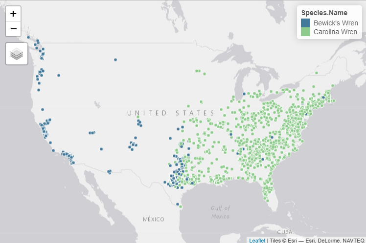
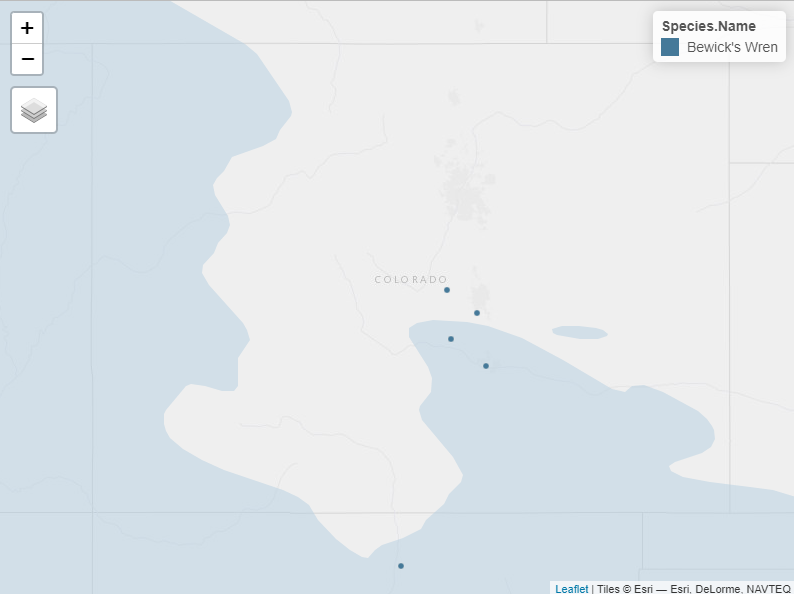

```{r setup, include=FALSE}
knitr::opts_chunk$set(warning = FALSE, 
                      message = FALSE,
                      collapse = TRUE,
                      comment = "#>",
                      out.width = "100%",
                      fig.height = 4, 
                      fig.width = 7, 
                      fig.align = "center")
# only build vignettes locally and not for R CMD check
knitr::opts_chunk$set(eval = nzchar(Sys.getenv("BUILD_VIGNETTES")))
library(nestwatchR)
```

Before analysis, analysts should consider conducting finer-scale filtering in order to clean the NestWatch dataset after running [`nw.cleandata()`](https://engagement-center.github.io/nestwatchR/reference/nw.cleandata.html). This may include selecting certain species, identifying specific nest phenology dates (i.e., incubation should not last longer than X days for species Y), or limiting nest attempts to a certain geographic area.

## Filter Species

Limiting the dataset to just a few species can easily be done using the pipe (`%>%`). If you are unfamiliar with "piping", see the [`migritrr`](https://magrittr.tidyverse.org/) package. Below we will subset the version 2 of the NestWatch dataset to include only attempts for Bewick's Wren ("bewwre") and Carolina Wren ("carwre"). The code below walks through download, merging, and filtering to species from scratch.

```{r filter to spp, eval = F}
library(nestwatchR)
library(dplyr)

# Download and merge datasets
nw.getdata(version = 2)
nw.mergedata(attempts = NW.attemps, checks = NW.checks, output = "merged.data")

# Filter data to include only carwre and bewwre
wrens <- merged.data %>% filter(Species.Code %in% c("carwre", "bewwre"))

# View what species are in the new dataset
unique(wrens$Species.Name)
> [1] "Carolina Wren" "Bewick's Wren"

```

<br> This "wrens" data subset is also included within the package for quick access using `wrens <- nestwatchR::wren_quickstart`:

```{r load the data, eval = T, echo = F, message=FALSE, }
library(dplyr)
wrens <- nestwatchR::wren_quickstart
```

## Filter Spatially

Spatial filters are a flexible way to limit data to a predefined geographic area. You may choose to limit an analysis to nesting attempts within a certain area, like a single [Bird Conservation Region](https://nabci-us.org/resources/bird-conservation-regions-map/) or a select number of states. Or one may choose to clean potentially misidentified species by using a range map to filter out nesting attempts. If those filtering criteria are easily subset from the dataset, like states and countries (via `Subnational.Code`), you can quickly use subsetting rules to filter the data for analysis. But, if those criteria are not already easily subset-able, a spatial filter can be a good option.

As an example, we can first view a plot of where the nests in `wrens` are located by species. Here we will use the package [`tmap`](https://cran.r-project.org/web/packages/tmap/vignettes/tmap-getstarted.html) to produce an interactive map. We will also be utilizing the [`sf`](https://r-spatial.github.io/sf/) package to help create and transform our tabular data into spatial data. We will then project the wrens data into the Lambert Conformal Conic Projection, which is well suited for mapping areas in the United States (but you can change the object `prj` to any appropriate PROJ.4 string for the area you are mapping).

[!Note] If you are unfamiliar with working with spatial data, [this is a good resource](https://bookdown.org/mcwimberly/gdswr-book/coordinate-reference-systems.html) on coordinate reference systems and projections within R.

```{r wren nests, eval = F, echo = T}
# Create a spatial object from nest data
nest_points <- sf::st_as_sf(wrens, coords = c("Longitude", "Latitude"), crs = 4326)  # data are in WGS 84 (crs = 4326)

# Define desired CRS for data projection
proj <- "+proj=lcc +lon_0=-90 +lat_1=33 +lat_2=45"  # PROJ.4 string defining the projection
  

# Project the nest points into LCC projection  
nest_points <- sf::st_transform(nest_points, crs = proj)   # apply projection

# Map nest locations
library(tmap)
tmap_mode("view")                                             # starts interactive plot
map <- tm_basemap("Esri.WorldGrayCanvas") +                   # define basemap
       tm_shape(nest_points) +                                # add nest point data
          tm_dots(col = "Species.Name",                       # color nests by species
                  palette = c("#457999", "#8DCA8B"),
                  border.col = "white")

# View the map
map                                                           

```



By looking at this map, we can see that there are several suspicious nests identified as Bewick's Wrens in the eastern United States. Bewick's Wrens are not typically recorded east of the Mississippi River, so some of these records could be misidentified. We could decide on a subset of states/provinces to filter out-of-range nest attempts, but a better method might be to filter nest locations based on a range map.

### eBird Range Map Polygons

The [eBird Status and Trends Products](https://science.ebird.org/en/status-and-trends) contain a wealth of information on bird populations. Among the available products are range maps of species for which Status and Trend Models have been run. These data are easily accessible in R through the [`ebirdst`](https://ebird.github.io/ebirdst/) package. To access these eBird data, you will need to acquire a free access key. This key will give you access to Status and Trends Data within R. For more information and to acquire an access key, see the [documentation here](https://ebird.github.io/ebirdst/).

We can use our unique access key to download the range map of Bewick's Wren and Carolina Wren. Note, you will need the 6-letter species codes of those species you would like to download, not their alpha code or common name. By modifying the access key, species, and download location in the code below, you can download and open the range polygons to your global environment. This code selects only the breeding range layer if available, and if unavailable then selects the resident range layer. Note: You only need to input your access key once (R will store it for you!) and you only need to download the range maps once (you may get an error if you rerun [`ebirdst_download_status()`](https://ebird.github.io/ebirdst/reference/ebirdst_download_status.html) when the data already exists at the `spatialdata_path` location). You may also need to modify the year in the code belo depending on what Status & Trends data product is available.

```{r not run download range, eval = F, echo = T}
# Obtain and set an ebird access key
set_ebirdst_access_key("pasteyourkeyhere")      # you only need to do this once, R will remember it

# Define what species you want to download by their 6-letter code
spp <- c("bewwre", "carwre")

# Specify where the data will be downloaded
# Here we will reference a folder called "spatial" in our working directory:
spatialdata_path <- c("spatial")  

# Download range maps by species
for (i in spp) {
  ebirdst_download_status(species = i, download_abundance = FALSE, 
                          download_ranges = TRUE, pattern = "_smooth_27km_", 
                          path = spatialdata_path)
}

# You may need to modify the year below to reflect the appropriate S&T product that downloaded
# Read in the range files
for (i in spp) {
  # Generate the path to the .gpkg files
  file_path <- paste0(spatialdata_path, "/2022/", i, "/ranges/", i, "_range_smooth_27km_2022.gpkg")
  # Read in the .gpkg file
  range_data <- st_read(file_path)
  # Generate the name for the object
  object_name <- paste0(i, "_range")
  # Assign the value to the dynamically-generated object name
  assign(object_name, range_data)
  rm(range_data)
}

# Select just breeding layer if available, else resident layer
object_names <- paste(spp, "range", sep = "_")
for (i in object_names) {
  if (i %in% ls(envir = .GlobalEnv)) {
    data <- get(i, envir = .GlobalEnv)
    if (any(data$season %in% "breeding")) {
      data <- data %>% filter(season == "breeding")
      data <- data %>% st_transform(nest_points, crs = prj)
      assign(paste0(i), data, envir = .GlobalEnv)
    } else {
      data <- data %>% filter(season == "resident")
      data <- data %>% st_transform(nest_points, crs = prj)
      assign(paste0(i), data, envir = .GlobalEnv)}
    rm(data)
  }
}

# Clean up intermediate objects
rm(file_path, i, object_name, object_names, spatialdata_path)


```

<br> Now that we have range polygons for Bewick's and Carolina Wrens, we can add them to our map and investigate our nest locations a bit closer. Let's plot just the Bewick's Wren data.

```{r read in range polygon from package, eval = T, echo = F, results='hide'}
path <- invisible(system.file("exdata", "bewwre_range.shp", package = "nestwatchR"))
bewwre_range <- sf::st_read(path)

```

```{r plot bewwre data, eval = F, echo = T}
# Subset nest locations to Bewick's Wrens
bewwre <- nest_points %>% filter(Species.Code == "bewwre")

# Map the nests onto the range polygon
tmap_mode("view")                                           # starts interactive plot
map <- tm_basemap("Esri.WorldGrayCanvas") +                 # define basemap
  tm_shape(shp = bewwre_range, name = "Bewick's Wren") +    # add range polygon, 
    tm_polygons(alpha = 0.5, 
                col = "#B4CFE1", border.col = NULL) +       # define polygon color      
  tm_shape(bewwre) +                                        # add nest points
    tm_dots(col = "Species.Name", 
            border.col = "grey90", palette = c("#457999"))  # define nest point color
map

```


<br>

We can now see that there are more than a few nests outside of the typical Bewick's Wren range. But a few of these nests are also close to the range border and *may* truly belong to a Bewick's Wren. We can use [`nw.filterspatial()`](https://engagement-center.github.io/nestwatchR/reference/nw.filterspatial.html) to help us identify and/or remove nest attempts outside of the range polygon (or any other shapefile you may want to filter by).

[`nw.filterspatial()`](https://engagement-center.github.io/nestwatchR/reference/nw.filterspatial.html) requires the input of `sf` objects for `points =` and `polygon =`, representing the nest points to be filtered and the shapefile by which they are filtered, respectively. The `mode =` argument is used to define if points identified outside the polygon should be flagged for review ("flagged") or removed from the dataset ("remove"). This function also has an optional buffer argument `buffer =` where the user may define a distance outside the polygon for which nest locations will be allowed. This distance can be either in kilometers or miles and should be defined using `buffer_units = "km"` or `= "mi"`. The resulting buffer polygon may be optionally exported to the global environment for saving or plotting using the logical `buffer_output = T`. The user may also define their desired projection using `proj =` and inputting a PROJ.4 string. If not provided the function will default to the Lambert Conformal Conic which is well suited for plotting the majority of NestWatch data at this time. Finally, the optional `output =` argument can be used to name the resulting spatially-cleaned spatial dataframe.

If we zoom in to central Colorado, we can see there are a few Bewick's Wren nests just outside the range border.



We might choose to keep nests like these in our analysis, because they could be correctly identified and just a bit outside the typical range. Let's define a buffer zone to keep such nests but exclude those well outside the expected range:

```{r run spatial filter, eval = F, echo = T}
nw.filterspatial(points = bewwre,                    # Bewick's Wren nest points 
                 polygon = bewwre_range,             # Bewick's Wren range shapefile
                 mode = "flag",                      # flag points outside 
                 buffer = 50,                        # add a 50km buffer zone
                 buffer_units = "km",                # units = km
                 buffer_output = T,                  # yes, output the buffer polygon
                 proj = "+proj=lcc +lon_0=-90 +lat_1=33 +lat_2=45",   # LCC from above
                 output = "flagged_nests")           # define the output name

```

<br> We can plot the results to see which points were flagged for review (and would be removed if mode was ste to "remove"):

```{r plot buffered, eval = F, echo = T}
# Relabel nests within range for nice map symbology
flagged_nests$Flagged.Location[is.na(flagged_nests$Flagged.Location)] <- "In-Range"

map <- tm_basemap("Esri.WorldGrayCanvas") +                 # define basemap
  tm_shape(shp = polygon_buffered, name = "50km Buffer") +  # add buffered polygon, define color
    tm_polygons(alpha = 0.5, col = "#CEE6F3", border.col = NULL) +                         
  tm_shape(shp = bewwre_range, name = "Bewick's Wren Range") +  # add range polygon, define color
    tm_polygons(alpha = 0.5, col = "#B4CFE1", border.col = NULL) +                         
  tm_shape(flagged_nests) +                                 # add nest points, color by "Flagged.Attempt"
    tm_dots(col = "Flagged.Location", 
            palette = c("#B31B1B", "#457999"),
            border.col = "white")    
map

```


<br>

We can now quickly filter out those nests with flagged locations outside of our defined range.

```{r remove out of range, eval = F, echo = T}
# Remove flagged attempts
nests_cleanlocs <- flagged_nests %>% filter(Flagged.Location == "In-Range")

```

## Filter Using Nest Phenology

You may also choose to refine the coarse phenologic filtering done in the cleaning process of [`nw.cleandata()`](https://engagement-center.github.io/nestwatchR/reference/nw.cleandata.html). NestWatch data are known to have some errors where participants either enter dates incorrectly (i.e., enter the year portion of a date as 2021 in one field and 2020 in the next) or incorrectly continue a nest attempt when it should be considered a new nest (i.e. nest usurpation or failure-and-rebuild). As an example of the latter, if a bluebird nest fails due to predation and the pair renests in the same box, this should be entered as two different attempts at the same location. But records of these "run-on nests" where the first attempt was not ended do exist in the dataset. One way a user might choose to identify or remove such nesting attempts, or ones which are outside of the expected nesting timeline for a given species, is to use phenologic filtering.

Phenologic filtering allows the user to define the allowed maximum number of days for each different period in the nesting cycle, or for the whole nesting cycle. The function [`nw.filterphenology()`](https://engagement-center.github.io/nestwatchR/reference/nw.filterphenology.html) uses both the data in the attempt summary info (data originating from the "Attempts" dataset) and the individual visits data (originating from the "Checks" dataset). Because this function uses both summary and checks data, we highly recommend running the series of estimation functions provided in the package to estimate summary dates where they were not specifically provided by the participant (see: [`nw.estclutchsize()`](https://engagement-center.github.io/nestwatchR/reference/nw.estclutchsize.html), [`nw.estfirstlay()`](https://engagement-center.github.io/nestwatchR/reference/nw.estfirstlay.html), [`nw.esthatch()`](https://engagement-center.github.io/nestwatchR/reference/nw.esthatch.html), and [`nw.estfledge()`](https://engagement-center.github.io/nestwatchR/reference/nw.estfledge.html)). Running theses estimations can increase the amount of information available for phenologic filtering.

For this function, a small user-created dataframe in the following format is needed. These values represent the *maximum* allowable number of days a nest of a particular species can be in each nesting stage. "Total" refers to the number of days spanning the initiation of nest building though fledging. In this example we will continue using use NestWatch data for Bewick's Wren and Carolina Wren:

```{r filter phen, eval = T}
## 1. Load, Clean, & Estimate Data 

# Load the supplied `wrens` dataset
data <- nestwatchR::wren_quickstart
length(unique(data$Attempt.ID))
# > [1] 7626      # number of nesting attempts for Bewick's and Carolina Wren

# Run cleaning function 
nw.cleandata(data = data, 
             mode = "remove", 
             methods = c("a", "b", "c", "d", "e", "f", "g", "h", "i", "j", "k"),
             output = "data")

# Run summary date estimation functions
# Create average phenological dates df by species
avg_phen <- data.frame(Species = c("bewwre", "carwre"),
                       Clutch.Size  = c(5, 4),
                       Eggs.per.Day = c(1, 1),
                       Incubation   = c(16, 16),
                       Nestling     = c(16, 13))

nw.estclutchsize(data = data, output = "data")
nw.estfirstlay(data = data, phenology = avg_phen, output = "data")
nw.esthatch(data = data, phenology = avg_phen, output = "data")
nw.estfledge(data = data, phenology = avg_phen, output = "data")
```

<br>

```{r phen filtering, eval = T}
## 2. Filter Data using Max Phenologies

# Create simple df with maximum allowable # days in each nest phase for Bewick's and Carolina Wrens
# You can provide data for a single species or multiple species to be run at the same time:
max_days <- 
  data.frame(species =  c("bewwre", "carwre"),
             lay = c(8, 6),           # here we chose max recorded clutch size
             incubation = c(20, 20),  # here means plus a bit of buffer
             nestling = c(20, 20),    # here means plus a bit of buffer
             total = c(60, 55))       # here means (build-to-fledge, plus a bit of buffer)

# Filter attempts based on nesting phenology
nw.filterphenology(data = data,
                   mode = "flag", 
                   max_phenology = max_days, 
                   trim_to_active = TRUE,
                   output = "flagged_phenology")


# How many attempts were flagged?
flagged <- flagged_phenology %>% filter(Flagged.Attempt == "FLAGGED")
length(unique(flagged$Attempt.ID))
# > [1] 448       # number of attempts which were flagged

# How many checks were flagged?
flagged <- flagged_phenology %>% filter(Flagged.Check == "FLAGGED")
length(unique(flagged$Attempt.ID))
# > [1] 769       # number of checks which were flagged
```

<br>

This function also has the logical argument `trim_to_active`. This argument specifies if nest checks before a nest was active (before building activity, observed eggs, observed young) or after nest fledge/failure should be noted for flagging or removal. By setting this argument to `TRUE`, individual nest checks outside the active period will be removed if `mode = "remove"` or noted with a `"FLAGGED"` tag in the new `Flagged.Check` column for you to manually inspect.

<br> We can visualize the distribution of active nesting periods of Carolina Wrens in our example before and after being filtered and trimmed.

```{r visualize filtering, echo = T, eval=T}
#| fig.alt: A histogram displaying the distrubution of nesting periods before and after filtering.
# Calculate the unfiltered date span of each nest
unfiltered <- data %>% filter(Species.Code == "carwre") %>% 
                       group_by(Attempt.ID) %>% arrange(Visit.Datetime) %>% 
                       mutate(nesting_period = as.numeric(
                            max(Visit.Datetime) - min(Visit.Datetime)))  # date span

# Filter the data from phenology flags, calculate filtered date spans
filtered <- flagged_phenology %>% group_by(Attempt.ID) %>% arrange(Visit.Datetime) %>% 
                                  filter(Species.Code == "carwre") %>% 
                                  filter(is.na(Flagged.Attempt)) %>% 
                                  filter(is.na(Flagged.Check)) %>% 
                                  mutate(nesting_period = as.numeric(max(Visit.Datetime) - min(Visit.Datetime)))

# Visualize filtered vs unfiltered date spans
library(ggplot2)
ggplot() +
  geom_histogram(data = unfiltered, aes(x = nesting_period, fill = "Unfiltered"), color = "#69A0C2") +
  geom_histogram(data = filtered, aes(x = nesting_period, fill = "Filtered"), color = "grey90", alpha = 0.5) +
  scale_fill_manual(values = c("Unfiltered" = "#457999", "Filtered" = "#8DCA8B"), name = "Dataset") +
  xlim(0, 250) + 
  xlab("Carolina Wren Nesting Periods") +
  ylab("Count") +
  geom_vline(xintercept = 55, linetype = "dashed", linewidth = 2, color = "black") +
  annotate("text", x = 85, y = 4500, label = "55 day limit", color = "black", vjust = -0.5) +
  theme_minimal()
```

We can see that there were more than a few nests with long nesting periods before filtering. After filtering out 448 attempts deemed "too long", we are left with 2,539 attempts to continue an analysis with.
